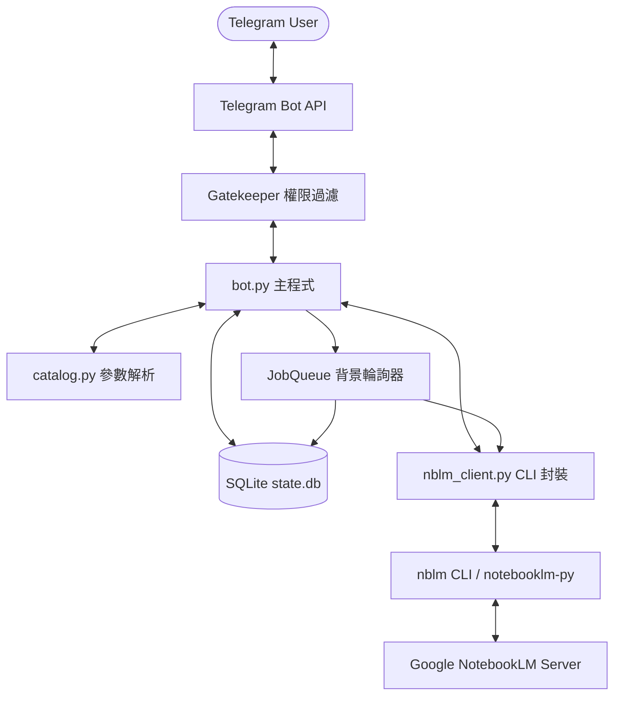
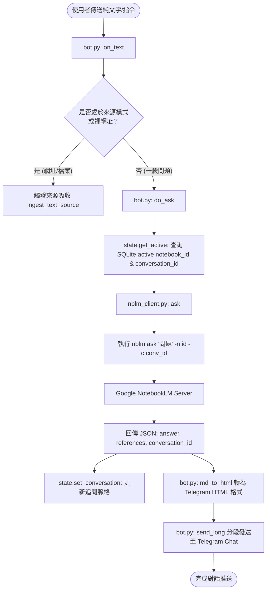

# 📓 YangNBLM_bot (lm-bot) — Google NotebookLM Telegram 智能助理

🌐 **Language / 語言**: **[ 繁體中文 | [English](README_EN.md) ]**

`YangNBLM_bot` 是一個以 Python 打造的 Telegram 前端 Bot 服務，將 **Google NotebookLM (Gemini Notebook)** 的強大知識庫、AI 提問、來源管理以及 Studio 製品生成功能完整串接至 Telegram 介面。

本專案支援 **多用戶對話隔離**、**免指令直接提問**、**一鍵觸發 9 種 Studio 製品生成與檔名推送**、**自動化網路研究 (Fast / Deep Research)** 以及 **權限白名單機制**。

---

## 📚 引用外部專案與技術棧 (Dependencies & Tech Stack)

### 引用外部專案
本專案的核心 backend 引擎基於 GitHub 開源專案：
* **[teng-lin/notebooklm-py](https://github.com/teng-lin/notebooklm-py)**：Google Gemini Notebook 的非官方 Python API & CLI 工具。
* **介面整合方式**：本專案透過 `/home/ubuntu/.local/bin/nblm` 腳本全域呼叫 `notebooklm-py` CLI，將 API 操作包裝為非同步 subprocess 呼叫，實現與 NotebookLM 伺服器端的溝通。

### 技術棧 (Tech Stack)
1. **Core Language & Runtime**: Python 3.10+
2. **Telegram Framework**: `python-telegram-bot` (v20+ Async Framework)
3. **Database**: SQLite3 (使用 Python 原生 `sqlite3` 與 thread locking 機制)
4. **Environment & Process Management**: `uv` (Fast Python package installer and resolver)
5. **Subprocess Management**: Python `asyncio.subprocess` (處理 CLI 命令執行與逾時控制)

---

## 🔑 NotebookLM 的登入與認證機制 (Authentication)

Google NotebookLM 官方目前**未提供公開的 OAuth API 介面**，因此底層 `notebooklm-py` 是採用模擬真實瀏覽器取得的 **Google Session Cookies** 進行身份驗證。

### 驗證原理
驗證依賴於 Google 帳號的 Cookie 組合（包含 `SID`, `HSID`, `SSID`, `APISID`, `SAPISID`, `__Secure-1PSID`, `__Secure-1PSIDTS` 等）。其中 `__Secure-1PSIDTS` 的有效期限較短（約 600 秒刷新一次），`notebooklm-py` 內部會自動處理 Cookie 旋轉 (L1 RotateCookies POST)。

### 登入與認證設定方式

#### 1. 互動式 CLI 登入 (`notebooklm login`)
在伺服器端或本地終端機執行：
```bash
notebooklm login
```
* **運作機制**：首次執行會自動下載 Playwright Chromium 瀏覽器（約 170MB），並彈出瀏覽器畫面引導使用者登入 Google 帳號。登入完成後，驗證 Cookie 會自動儲存至 `~/.notebooklm/storage_state.json`。

#### 2. Cookie 匯入 / 瀏覽器擴充功能 (`notebooklm auth import`)
無頭伺服器 (Headless Server) 或遠端環境可以透過匯入已有 Cookie 進行驗證：
```bash
notebooklm auth import /path/to/cookies.json
```

#### 3. 自動刷新與持久化認證 (L4 Master-Token Re-mint)
為了確保 Bot 長期運作不中斷，`notebooklm-py` 支援 L4 Master Token 重新簽發機制（Master-token re-mint）。即便 Cookie 暫時過期，內部也能在背景自動向 Google 重新取得無頭驗證憑證，無需人工介入重新登入。

#### 4. 驗證狀態檢查
在專案中可隨時透過 CLI 檢查驗證狀態：
```bash
notebooklm auth check --test --json
```

---

## ⚙️ 系統架構與工作流程 (Architecture & Workflow)



### 關鍵運作流程：
1. **白名單與自動綁定 (Gatekeeper)**：
   訊息抵達時，`TypeHandler` (group -1) 優先進入 `gatekeeper()`。若設定了 `ALLOWED_CHAT_IDS`，非白名單用戶將被拒絕。若白名單為空且 `ALLOW_FIRST_USER=True`，首位與 Bot 互動的使用者將自動綁定並寫回 `.env`。
2. **Chat 狀態隔離 (State Storage)**：
   每個 Telegram Chat 有獨立的作用中筆記本 (Active Notebook ID) 與對話追問脈絡 (Conversation ID)，儲存於 `state.db`，確保不同 Chat 或 concurrent 使用者不會互相干擾。
3. **免指令提問 (Commandless Q&A)**：
   使用者發送一般文字時，`on_text()` 判斷若非指令且非加入來源模式，會自動向作用中筆記本發起提問 (`nblm.ask()`)，並回傳附帶引用資料的回答。
4. **一鍵 Studio 製品生成與非同步輪詢 (Async Generation & Polling)**：
   - 使用者透過控制面板或指令 (如 `/audio`, `/slides`, `/infographic`) 請求生成。
   - `start_generation()` 呼叫 `nblm.generate()`。
   - 同步製品 (如心智圖 `mindmap`)：立即取得 JSON 並產生文字大綱推送至 Chat。
   - 非同步製品 (如語音 MP3、影片 MP4、簡報 PDF)：將任務寫入 SQLite `jobs` 資料表，由 `poll_jobs()` 每 45 秒背景輪詢。任務完成 (status=`completed`) 後自動呼叫 `deliver()` 將檔案下載至 `downloads/` 並推送回 Telegram Chat。

---

### 🧩 細項功能模組流程圖 (Detailed Functional Flowcharts)

#### 1. 免指令對話與追問脈絡資訊流 (Commandless Q&A Flowchart)

說明使用者發送純文字時，系統如何判定、提取對話脈絡、向 NotebookLM 提問並分段編輯傳送回 Telegram 的過程：



#### 2. 一鍵 Studio 製品生成與背景 Polling 資訊流 (Artifact Generation & Poller Flowchart)

說明非同步製品（語音 MP3、影片 MP4、簡報 PDF 等）從按鈕觸發、CLI 請求、SQLite 任務入隊到 JobQueue 背景輪詢推送的完整生命週期：


#### 3. 來源吸收與網路研究資訊流 (Source Ingestion & Web Research Flowchart)

說明網址、上傳檔案 (PDF/Word/音訊) 以及快速/深度網路研究 (Research Agent) 如何進入系統並完成索引：


---

## 📁 程式碼檔案用途與 Function 作用詳細說明

專案由 4 個主要 Python 程式碼檔案組成：

### 1. `bot.py` — Telegram Bot 主程式與控制邏輯
* `load_env()`, `_parse_allowlist()`, `_persist_allowlist()`, `main()`, `post_init()`: Bot 初始化與配置管理。
* `authorized()`, `gatekeeper()`: 權限檢查與白名單過濾。
* `esc()`, `md_to_html()`, `send_long()`, `panel_markup()`, `more_markup()`, `addsrc_markup()`: 格式化與 UI 選單。
* `cmd_start()`, `cmd_help()`, `cmd_notebooks()`, `cmd_panel()`, `cmd_sources()`, `cmd_artifacts()`, `cmd_new()`, `cmd_ask()`, `do_ask()`, `cmd_addsource()`, `cmd_newnotebook()`, `cmd_research()`, `cmd_deepresearch()`: 指令處理器。
* `on_text()`, `ingest_text_source()`, `do_research()`, `on_document()`, `on_callback()`: 訊息與事件監聽器。
* `start_generation()`, `_deliver_sync()`, `_mindmap_outline()`, `deliver()`, `_kind_from_type()`: 製品生成與傳送交付。
* `poll_once()`, `poll_jobs()`, `_check_job_by_id()`: 背景輪詢器。

### 2. `nblm_client.py` — NotebookLM CLI (`nblm`) 非同步封裝庫
* `NblmError`, `Artifact`, `_run()`, `_friendly_error()`, `_parse_json()`: 子行程執行器與錯誤解析。
* `list_notebooks()`, `list_sources()`, `create_notebook()`, `add_source()`, `add_research()`, `delete_source()`, `source_status()`: 筆記本與來源操作。
* `ask()`, `generate()`, `extract_artifact_id()`, `is_sync_payload()`, `list_artifacts()`, `artifact_status()`, `download()`, `auth_ok()`: AI 提問、生成、下載與驗證。

### 3. `catalog.py` — 製品種類、風格與語言參數解析器
* `CATALOG`, `PRIMARY`, `SECONDARY`, `EMOJI`: 製品對照表與顯示分類。
* `LANGUAGES`, `INFOGRAPHIC_STYLES`, `VIDEO_STYLES`, `ORIENTATIONS`, `AUDIO_FORMATS`, `REPORT_FORMATS`, `DIFFICULTY`: 多語言與風格字典。
* `parse_params()`: 輸入文字與選項解析。

### 4. `state.py` — SQLite 本地狀態管理庫
* `_conn()`, `init()`: 資料庫初始化。
* `set_active()`, `get_active()`, `clear_active()`, `set_conversation()`: Chat 狀態與對話 ID 管理。
* `add_job()`, `pending_jobs()`, `finish_job()`: 任務佇列管理。

## 🚀 專案啟動與 Telegram 串接說明 (How to Run & Integration)

### 1. 專案該如何啟動？ (Startup Steps)

#### 步驟一：確認環境變數 (.env)
在專案根目錄確認或建立 `.env` 檔案（可參考 `.env.example`）：
```env
TELEGRAM_BOT_TOKEN=您的_TELEGRAM_BOT_TOKEN
ALLOWED_CHAT_IDS=您的_TELEGRAM_ID
```

#### 步驟二：檢查底層 NotebookLM CLI 認證
確保伺服器上的 `nblm` 驗證狀態正常：
```bash
/home/ubuntu/.local/bin/nblm auth check
```
*(若認證失效，請在伺服器上執行 `notebooklm login` 完成 Google 登入)*

#### 步驟三：啟動 Bot 服務
在專案目錄下執行主程式 [`bot.py`](file:///home/ubuntu/lm-bot/bot.py)：
* **前台直接啟動 (Direct Run)**：
  ```bash
  python3 bot.py
  # 或使用虛擬環境
  /home/ubuntu/lm-bot/.venv/bin/python3 bot.py
  ```
* **背景常駐啟動 (Run in Background)**：
  ```bash
  nohup python3 bot.py > bot.log 2>&1 &
  ```

---

### 2. 與 Telegram 串接的主要程式在哪邊？

本專案與 Telegram 串接的所有核心邏輯與 API 監聽，全部集中在 **[`bot.py`](file:///home/ubuntu/lm-bot/bot.py)** 中。

#### 核心串接區塊說明：
1. **Telegram 監聽迴圈 (bot.py L992 ~ L1037)**：
   在 `main()` 中使用 `python-telegram-bot` 的 `Application.builder()` 載入 Token，並透過 `app.run_polling()` 開啟長輪詢監聽。
2. **Handlers 註冊 (bot.py L1008 ~ L1032)**：
   * `TypeHandler(Update, gatekeeper)`: 權限白名單過濾閘門 (group -1)。
   * `CommandHandler`: 處理 `/start`, `/notebooks`, `/panel`, `/ask`, `/research` 等指令。
   * `CallbackQueryHandler(on_callback)`: 處理 Inline Keyboard 控制面板按鈕點擊。
   * `MessageHandler(filters.Document..., on_document)`: 接收用戶在聊天室上傳的檔案 (≤20MB)。
   * `MessageHandler(filters.TEXT..., on_text)`: 實現免指令對話與網址自動吸收。
3. **Telegram API 方法呼叫**：
   * 文字與 Markdown 發送：`reply_text()`, `send_long()`
   * 打字狀態：`ctx.bot.send_chat_action(chat_id, ChatAction.TYPING)`
   * 多媒體主動推送：`send_audio()`, `send_video()`, `send_photo()`, `send_document()`
   * 檔案下載接收：`ctx.bot.get_file()` 與 `download_to_drive()`

---

## 🔒 權限白名單設定與 Telegram ID 取得指南

### 1. 如何取得您的 Telegram User ID？
* **使用 Telegram 機器人查詢**：發送訊息給 `@userinfobot` 即可取得一串數字 ID（例如 `7030555903`）。
* **首位使用者自動綁定**：若 `.env` 中的 `ALLOWED_CHAT_IDS=` 留空，第一個發送訊息給 Bot 的使用者會被自動綁定。

### 2. 增加白名單的實際操作步驟
編輯 `.env` 檔案中的 `ALLOWED_CHAT_IDS=`，多個 ID 以逗號分隔：
```env
ALLOWED_CHAT_IDS=7030555903,123456789
```

---

## ⚖️ 關於 `notebooklm-py` 的合法性、風險與法律問題

1. **合法性**：`notebooklm-py` 為非官方社群開源庫。個人學習、研究與個人知識庫自動化並不違法。
2. **風險**：Google 隨時可能修改 RPC 端點（更新庫即可修復）；高頻請求可能觸發 Rate Limit 限流。
3. **合規建議**：勿用於商業付費轉售或高頻惡意爬取，適合個人或小團隊內部私人使用。

