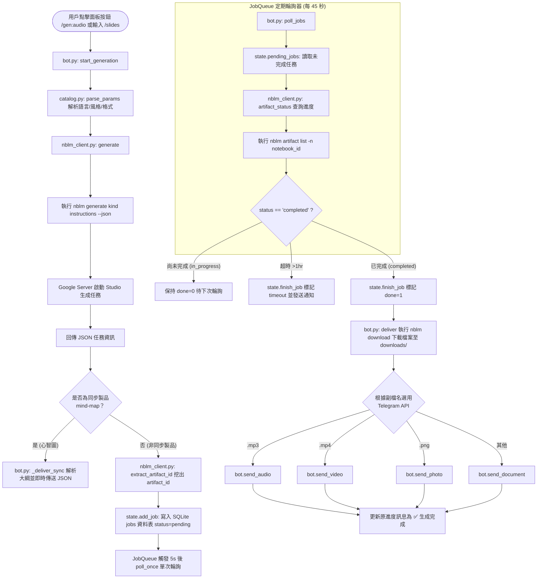
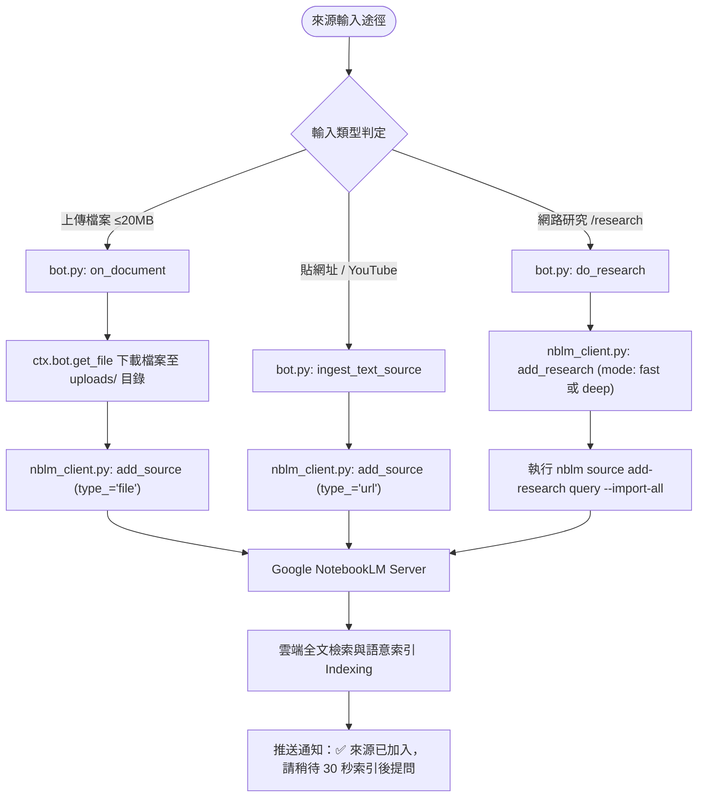

# 📓 YangNBLM_bot (lm-bot) — Google NotebookLM Telegram 智能助理

`YangNBLM_bot` 是一個以 Python 打造的 Telegram 前端 Bot 服務，將 **Google NotebookLM (Gemini Notebook)** 的強大知識庫、AI 提問、來源管理以及 Studio 製品生成功能完整串接至 Telegram 介面。

本專案支援 **多用戶對話隔離**、**免指令直接提問**、**一鍵觸發 9 種 Studio 製品生成與檔名推送**、**自動化網路研究 (Fast / Deep Research)** 以及 **權限白名單機制**。

---

## 📚 引用外部專案與技術棧 (Dependencies & Tech Stack)

### 引用外部專案
本專案的核心 backend 引擎基於 GitHub 開源專案：
* **[teng-lin/notebooklm-py](https://github.com/teng-lin/notebooklm-py)**：Google Gemini Notebook 的非官方 Python API & CLI 工具。
* **介面整合方式**：本專案透過 `/home/ubuntu/.local/bin/nblm` 腳本全域呼叫 `notebooklm-py` CLI，將 API 操作包裝為非同步 subprocess 呼叫，實現與 NotebookLM 伺服器端的溝通。

### 技術棧 (Tech Stack)
1. **Core Language & Runtime**: Python 3.10+
2. **Telegram Framework**: `python-telegram-bot` (v20+ Async Framework)
3. **Database**: SQLite3 (使用 Python 原生 `sqlite3` 與 thread locking 機制)
4. **Environment & Process Management**: `uv` (Fast Python package installer and resolver)
5. **Subprocess Management**: Python `asyncio.subprocess` (處理 CLI 命令執行與逾時控制)

---

## 🔑 NotebookLM 的登入與認證機制 (Authentication)

Google NotebookLM 官方目前**未提供公開的 OAuth API 介面**，因此底層 `notebooklm-py` 是採用模擬真實瀏覽器取得的 **Google Session Cookies** 進行身份驗證。

### 驗證原理
驗證依賴於 Google 帳號的 Cookie 組合（包含 `SID`, `HSID`, `SSID`, `APISID`, `SAPISID`, `__Secure-1PSID`, `__Secure-1PSIDTS` 等）。其中 `__Secure-1PSIDTS` 的有效期限較短（約 600 秒刷新一次），`notebooklm-py` 內部會自動處理 Cookie 旋轉 (L1 RotateCookies POST)。

### 登入與認證設定方式

#### 1. 互動式 CLI 登入 (`notebooklm login`)
在伺服器端或本地終端機執行：
```bash
notebooklm login
```
* **運作機制**：首次執行會自動下載 Playwright Chromium 瀏覽器（約 170MB），並彈出瀏覽器畫面引導使用者登入 Google 帳號。登入完成後，驗證 Cookie 會自動儲存至 `~/.notebooklm/storage_state.json`。

#### 2. Cookie 匯入 / 瀏覽器擴充功能 (`notebooklm auth import`)
無頭伺服器 (Headless Server) 或遠端環境可以透過匯入已有 Cookie 進行驗證：
```bash
notebooklm auth import /path/to/cookies.json
```
亦可配合 Desktop Extension 匯入匯出的 Cookie 檔。

#### 3. 自動刷新與持久化認證 (L4 Master-Token Re-mint)
為了確保 Bot 長期運作不中斷，`notebooklm-py` 支援 L4 Master Token 重新簽發機制（Master-token re-mint）。即便 Cookie 暫時過期，內部也能在背景自動向 Google 重新取得無頭驗證憑證，無需人工介入重新登入。

#### 4. 驗證狀態檢查
在專案中可隨時透過 CLI 檢查驗證狀態：
```bash
notebooklm auth check --test --json
```
在程式碼中由 `nblm_client.py` 的 `auth_ok()` 函式呼叫此命令以回報 Bot 認證狀態。

---

## ⚙️ 系統架構與工作流程 (Architecture & Workflow)


### 關鍵運作流程：
1. **白名單與自動綁定 (Gatekeeper)**：
   訊息抵達時，`TypeHandler` (group -1) 優先進入 `gatekeeper()`。若設定了 `ALLOWED_CHAT_IDS`，非白名單用戶將被拒絕。若白名單為空且 `ALLOW_FIRST_USER=True`，首位與 Bot 互動的使用者將自動綁定並寫回 `.env`。
2. **Chat 狀態隔離 (State Storage)**：
   每個 Telegram Chat 有獨立的作用中筆記本 (Active Notebook ID) 與對話追問脈絡 (Conversation ID)，儲存於 `state.db`，確保不同 Chat 或 concurrent 使用者不會互相干擾。
3. **免指令提問 (Commandless Q&A)**：
   使用者發送一般文字時，`on_text()` 判斷若非指令且非加入來源模式，會自動向作用中筆記本發起提問 (`nblm.ask()`)，並回傳附帶引用資料的回答。
4. **一鍵 Studio 製品生成與非同步輪詢 (Async Generation & Polling)**：
   - 使用者透過控制面板或指令 (如 `/audio`, `/slides`, `/infographic`) 請求生成。
   - `start_generation()` 呼叫 `nblm.generate()`。
   - 同步製品 (如心智圖 `mindmap`)：立即取得 JSON 並產生文字大綱推送至 Chat。
   - 非同步製品 (如語音 MP3、影片 MP4、簡報 PDF)：將任務寫入 SQLite `jobs` 資料表，由 `poll_jobs()` 每 45 秒背景輪詢。任務完成 (status=`completed`) 後自動呼叫 `deliver()` 將檔案下載至 `downloads/` 並推送回 Telegram Chat。

---

### 🧩 細項功能模組流程圖 (Detailed Functional Flowcharts)

#### 1. 免指令對話與追問脈絡資訊流 (Commandless Q&A Flowchart)

說明使用者發送純文字時，系統如何判定、提取對話脈絡、向 NotebookLM 提問並分段編輯傳送回 Telegram 的過程：


#### 2. 一鍵 Studio 製品生成與背景 Polling 資訊流 (Artifact Generation & Poller Flowchart)

說明非同步製品（語音 MP3、影片 MP4、簡報 PDF 等）從按鈕觸發、CLI 請求、SQLite 任務入隊到 JobQueue 背景輪詢推送的完整生命週期：



#### 3. 來源吸收與網路研究資訊流 (Source Ingestion & Web Research Flowchart)

說明網址、上傳檔案 (PDF/Word/音訊) 以及快速/深度網路研究 (Research Agent) 如何進入系統並完成索引：



---

## 📁 程式碼檔案用途與 Function 作用詳細說明

專案由 4 個主要 Python 程式碼檔案組成：

---

### 1. `bot.py` — Telegram Bot 主程式與控制邏輯

**檔案用途**：Telegram Bot 的應用程式入口點，處理命令註冊、權限攔截、訊息與 CallbackQuery 監聽、檔案上下傳處理、長訊息切割傳送及背景 Task 輪詢。

#### 核心 Function / Class 列表與詳細作用：

* **初始化與配置 (Setup & Config)**
  * `load_env()`: 讀取專案根目錄 `.env` 檔案並將設定寫入系統環境變數 (`TELEGRAM_BOT_TOKEN`, `ALLOWED_CHAT_IDS` 等)。
  * `_parse_allowlist(raw: str) -> set[int]`: 解析 `.env` 中以逗號或空格分隔的 User ID / Chat ID 白名單字串。
  * `_persist_allowlist()`: 將當前綁定的白名單動態更新並覆寫回 `.env` 檔案。
  * `main()`: 程式執行主入口。初始化 SQLite 資料庫、建立 Telegram `Application` 實例、設定 `post_init` 鉤子、加載過濾器與 handlers，並啟動 `job_queue` Repeating Task 與 Telegram Polling。
  * `post_init(app: Application)`: 在 Bot 啟動後向 Telegram API 註冊指令選單 (`set_my_commands`)，使使用者輸入 `/` 時能顯示選單。

* **權限與過濾 (Security & Authorization)**
  * `authorized(update: Update) -> bool`: 檢查發送 update 的使用者是否在授權白名單內。若白名單為空且 `ALLOW_FIRST_USER` 為 True，自動將該使用者綁定為管理員。
  * `gatekeeper(update: Update, ctx: ContextTypes.DEFAULT_TYPE)`: 註冊在 group -1 的高優先度 Handler，攔截所有未經授權的 Update 請求並發出警告訊息。

* **工具與格式化 (Utilities)**
  * `esc(text: str) -> str`: HTML 轉義字元處理，防止 Telegram HTML 語法解析失敗。
  * `md_to_html(text: str) -> str`: 將標準 Markdown 格式簡化轉譯為 Telegram 支援的 HTML 標籤（如粗體 `<b>`、程式碼 `<pre>` `<code>`、標題等）。
  * `send_long(msg_target, text: str, reply_markup=None, **kw)`: Telegram 訊息有 4096 字元限制。此函式按段落邊界自動切分長文字並分段發送，僅在最後一段附加 reply_markup。
  * `panel_markup(nb_title: str) -> InlineKeyboardMarkup`: 構建控制面板主要 Inline Keyboard 按鈕（語音、資訊圖表、心智圖、簡報、來源管理、換筆記本等）。
  * `more_markup() -> InlineKeyboardMarkup`: 構建控制面板第二頁按鈕（報告、測驗、學習卡、資料表、影片）。
  * `panel_text(title: str) -> str`: 產出控制面板上方顯示的 HTML 狀態文字。
  * `addsrc_markup() -> InlineKeyboardMarkup`: 產生「加入來源」的選單按鈕（網址、檔案、純文字、快速研究、深度研究）。

* **指令處理器 (Command Handlers)**
  * `cmd_start(update, ctx)`: `/start` 命令 handler，顯示歡迎資訊與完整指令說明。
  * `cmd_help(update, ctx)`: `/help` 命令 handler，顯示詳細的使用說明選單。
  * `cmd_notebooks(update, ctx)`: `/notebooks` 命令 handler，呼叫 `nblm.list_notebooks()` 取得雲端筆记本清單並以按鈕列出供選取。
  * `cmd_panel(update, ctx)`: `/panel` 命令 handler，開啟或重新傳送目前作用中筆記本的控制面板。
  * `cmd_sources(update, ctx)`: `/sources` 命令 handler，顯示目前筆記本的來源清單與索引狀態。
  * `_show_sources(target, ctx, row, manage: bool = False)`: 渲染來源清單與管理按鈕（支援一鍵刪除來源）。
  * `cmd_artifacts(update, ctx)`: `/artifacts` 命令 handler，顯示筆記本已生成的製品清單。
  * `_show_artifacts(target, ctx, row)`: 渲染已完成製品清單並附帶下載按鈕。
  * `cmd_new(update, ctx)`: `/new` 命令 handler，清除目前的 `conversation_id`，重置對話上下文追問脈絡。
  * `cmd_ask(update, ctx)`: `/ask <問題>` 命令 handler，手動指定提問內容。
  * `do_ask(update, ctx, question: str)`: 執行提問的核心邏輯。呼叫 `nblm.ask()`、儲存回傳的 `conversation_id` 於 SQLite，並發送 Markdown 轉換後的解答。
  * `cmd_addsource(update, ctx)`: `/add` / `/addsource` 命令 handler，開啟來源類型選單或直接吸收傳入的文字/網址。
  * `cmd_newnotebook(update, ctx)`: `/newnotebook <標題>` 命令 handler，建立全新 NotebookLM 筆記本並將其設為當前 Chat 的作用中筆記本。
  * `cmd_research(update, ctx)`: `/research <主題>` 命令 handler，啟動快速網路研究 (1-2 分鐘) 並自動將搜尋結果匯入來源。
  * `cmd_deepresearch(update, ctx)`: `/deepresearch <主題>` 命令 handler，啟動深度網路研究 (15-30 分鐘，爬取 20+ 來源)。
  * `make_gen_cmd(kind: str)`: 高階函式，動態生成各製品生成指令（如 `/audio`, `/slides`, `/mindmap` 等）的 Command Handler。

* **訊息與事件監聽 (Message & Callback Handlers)**
  * `on_text(update, ctx)`: 監聽純文字訊息。實現「免指令提問」；若使用者處於「加入來源模式」或單純貼上網址，則自動切換為來源吸收邏輯。
  * `ingest_text_source(target, ctx, chat_id, text, force_type)`: 解析輸入文字為網址列表或純文字，並呼叫 `nblm.add_source()` 加入筆記本來源。
  * `do_research(target, ctx, chat_id, query, mode)`: 呼叫 `nblm.add_research()` 執行網路研究並追蹤新增來源數。
  * `on_document(update, ctx)`: 監聽上傳的檔案 (Document, Audio, Video, Photo, Voice)，透過 `ctx.bot.get_file()` 下載至 `uploads/` 目錄（限制 20MB 以內），再呼叫 `nblm.add_source()` 加入筆記本。
  * `on_callback(update, ctx)`: 處理所有 Inline Keyboard 點擊事件 (如選取筆記本 `nb:`, 生成製品 `gen:`, 刪除來源 `delsrc:`, 下載製品 `dl:` 等)。

* **製品生成與交付 (Artifact Generation & Delivery)**
  * `start_generation(target, ctx, chat_id, kind, raw)`: 觸發製品生成。解析輸入參數後呼叫 `nblm.generate()`；同步製品直接呼叫 `_deliver_sync()`，非同步製品記錄至 `state.add_job()` 入隊。
  * `_deliver_sync(ctx, chat_id, status, kind, zh, res, nb_title)`: 交付心智圖等同步製品，將 JSON 寫入 `downloads/` 並輸出文字大綱。
  * `_mindmap_outline(node, depth, lines) -> str`: 遞迴將心智圖 JSON 轉化為縮排文字樹狀大綱。
  * `deliver(ctx, chat_id, notebook_id, artifact_id, kind, label) -> bool`: 呼叫 `nblm.download()` 將完成的製品下載至本機，並依據副檔名選用 `send_photo`, `send_audio`, `send_video` 或 `send_document` 傳送給 Telegram 使用者。
  * `_kind_from_type(type_str, title)`: 根據副檔名與類型字串推導製品種類。

* **背景 Poller 機制 (Background Polling)**
  * `poll_once(ctx)`: 任務建立後短暫延遲觸發的單次 Poller 檢查。
  * `poll_jobs(ctx)`: 經由 Telegram `JobQueue` 每 45 秒定時執行的輪詢任務，檢查 SQLite 中所有 `done=0` 的 pending jobs。
  * `_check_job_by_id(ctx, artifact_id, chat_id, job)`: 呼叫 `nblm.artifact_status()` 查詢雲端任務狀態。完成時自動發送檔案並更新狀態；超過 1 小時 (JOB_TIMEOUT) 則停止追蹤。

---

### 2. `nblm_client.py` — NotebookLM CLI (`nblm`) 非同步封裝庫

**檔案用途**：封裝對 `nblm` (即 `notebooklm-py` CLI) 的呼叫，提供非同步 (`async/await`) 介面，解析 CLI 輸出的 JSON，並處理 subprocess 超時與錯誤翻譯。

#### 核心 Function / Class 列表與詳細作用：

* `NblmError(RuntimeError)`: 自訂例外類別，包裝 CLI 執行的 `exit_code` 與 `stderr` 資訊。
* `Artifact`: Dataclass，代表製品物件 (`id`, `title`, `type`, `status`)。
* `_run(args: list[str], timeout: int = 180) -> str`: 核心 subprocess 執行器。使用 `asyncio.create_subprocess_exec` 呼叫 `nblm`，補全 `PATH` 與 `HOME` 環境變數，捕獲 stdout/stderr 並處理 Timeout。
* `_friendly_error(stderr: str) -> str`: 錯誤轉譯器。分析 stderr 內容，將常出現的底層錯誤（如 `permission denied`, `auth expired`, `rate quota`）轉換為中文提示。
* `_parse_json(raw: str) -> dict`: 安全 JSON 解析器。因 CLI 可能包含 rich-console 控制碼或雜訊，此函式會自動比對並擷取第一個有效的 JSON 物件 (`{...}`)。
* `list_notebooks() -> list[dict]`: 執行 `nblm list --json`，返回用戶的所有 Notebook 列表。
* `list_sources(notebook_id: str) -> list[dict]`: 執行 `nblm source list --notebook <id> --json`，取得指定筆記本的所有來源列表。
* `create_notebook(title: str) -> dict`: 執行 `nblm create <title> --json`，建立新筆記本。
* `add_source(notebook_id, content, type_, title) -> dict`: 執行 `nblm source add <content> --notebook <id> --json`，新增 URL、檔案或純文字來源。
* `add_research(notebook_id, query, mode) -> dict`: 執行 `nblm source add-research <query> --notebook <id> --mode <fast|deep>`，執行自動化網路研究。
* `delete_source(notebook_id, source_id)`: 執行 `nblm source delete <source_id> -y`，刪除指定來源。
* `source_status(notebook_id, source_id) -> str`: 查詢指定來源的處理狀態 (`ready`, `processing`, `error`)。
* `ask(notebook_id, question, conversation_id) -> dict`: 執行 `nblm ask <question> --notebook <id> [-c conversation_id]`，進行 AI 問答。
* `generate(notebook_id, kind, instructions, **opts) -> dict`: 執行 `nblm generate <kind> [instructions] --notebook <id>`，請求 Studio 生成製品。
* `extract_artifact_id(data: dict) -> str`: 從 `generate` 回傳的 JSON 結構中遞迴擷取 `artifact_id` 或 `task_id`。
* `is_sync_payload(data: dict) -> bool`: 判斷 `generate` 回傳是否為同步交付的內容（例如含有 `mind_map` 結構）。
* `list_artifacts(notebook_id: str) -> list[Artifact]`: 執行 `nblm artifact list`，取得筆記本的製品清單。
* `artifact_status(notebook_id, artifact_id) -> str`: 查詢特製製品的生成進度 (`completed`, `in_progress`, `pending`)。
* `download(notebook_id, kind, artifact_id, dest, fmt) -> str`: 執行 `nblm download <kind> <dest> -n <notebook_id> -a <artifact_id>`，將生成檔案下載到伺服器本地。
* `auth_ok() -> bool`: 執行 `nblm auth check` 測試當前登入憑證是否有效。

---

### 3. `catalog.py` — 製品種類、風格與語言參數解析器

**檔案用途**：定義 9 種 Studio 製品的映射關係、中文名稱、預估生成時間、預設副檔名，並提供強大的參數解析器將用戶的自由文字拆解為 `nblm` 支援的選項參數。

#### 核心字典與 Function：

* `CATALOG`: 核心對照表。映射 `kind` -> `(nblm generate kind, 中文名, download kind, 副檔名, download format, 預估分鐘)`。
  * 支援種類：`audio` (語音摘要), `infographic` (資訊圖表), `mindmap` (心智圖), `slides` (簡報), `report` (報告), `quiz` (測驗), `flashcards` (學習卡), `datatable` (資料表), `video` (影片)。
* `PRIMARY`, `SECONDARY`: 控制面板分頁的顯示順序。
* `EMOJI`: 製品對應的表情符號對照表。
* `LANGUAGES`, `INFOGRAPHIC_STYLES`, `VIDEO_STYLES`, `ORIENTATIONS`, `AUDIO_FORMATS`, `REPORT_FORMATS`, `DIFFICULTY`: 多語言（如 `zh_Hant`）、繪圖風格（如 `sketch-note`, `bento-grid`）、影片風格、圖片方向、音訊格式與難度關鍵詞映射。
* `parse_params(kind: str, text: str) -> tuple[str, dict]`: 參數解析函式。將使用者輸入的字串（如 `/infographic QA 繁體中文/手繪`）自動拆解為 `instructions` ("QA") 與 `opts` (`{"language": "zh_Hant", "style": "sketch-note"}`)。

---

### 4. `state.py` — SQLite 本地狀態管理庫

**檔案用途**：封裝 SQLite (`state.db`) 的 CRUD 操作，帶有 Thread Lock (`threading.Lock`) 確保多線程存取安全，管理 Telegram Chat 的作用中筆記本與背景任務佇列。

#### 核心 Function 列表與詳細作用：

* `_conn() -> sqlite3.Connection`: 建立 SQLite 資料庫連線，開啟 10 秒 timeout 與 `sqlite3.Row` 格式輸出。
* `init()`: 初始化資料庫，建立 `chat_state`（記錄 chat_id, notebook_id, title, conversation_id, updated_at）與 `jobs`（記錄 artifact_id, chat_id, notebook_id, kind, label, status_msg_id, created_at, done）兩張資料表。
* `set_active(chat_id: int, notebook_id: str, title: str)`: 設定或更新特定 Chat 的作用中筆記本，並重置對話上下文。
* `get_active(chat_id: int) -> sqlite3.Row | None`: 取得特定 Chat 目前設定的作用中筆記本。
* `clear_active(chat_id: int)`: 清除特定 Chat 的作用中筆記本設定。
* `set_conversation(chat_id: int, conversation_id: str | None)`: 更新或重置特定 Chat 的追問對話 ID。
* `add_job(artifact_id, chat_id, notebook_id, kind, label, status_msg_id)`: 新增一筆待處理的非同步製品生成任務到 `jobs` 資料表。
* `pending_jobs() -> list[sqlite3.Row]`: 查詢所有 `done=0` 的未完成任務，供 `poll_jobs()` 背景輪詢。
* `finish_job(artifact_id: str, chat_id: int)`: 將任務標記為完成 (`done=1`)。

---

## 🤖 Telegram 串接方式與使用的 API 功能 (Telegram Integration & APIs)

本專案採用 `python-telegram-bot` (v20+ Async) 與 Telegram Bot API 進行溝通，主要使用的 API 介面與功能包含：

| Telegram API 方法 / 物件 | 專案中之用途說明 |
| :--- | :--- |
| `Application.builder().token().build()` | 初始化 Telegram Bot 應用程式與事件監聽迴圈。 |
| `CommandHandler` | 監聽 `/start`, `/help`, `/notebooks`, `/panel`, `/ask`, `/sources`, `/artifacts` 等自訂指令。 |
| `MessageHandler` | 監聽純文字 (`filters.TEXT`) 實現「免指令提問」；監聽檔案/媒體 (`filters.Document` / `PHOTO` / `AUDIO` / `VIDEO`) 實現檔案自動匯入。 |
| `CallbackQueryHandler` | 處理 Inline Keyboard 按鈕點擊事件（選擇筆記本、生成製品、選單切換、刪除來源等）。 |
| `TypeHandler` (group -1) | 權限過濾 Gatekeeper，在所有處理器執行前攔截未授權用戶。 |
| `bot.send_message()` / `reply_text()` | 發送文字訊息，支援 HTML 解析模式與 `reply_markup` 選單按鈕。 |
| `bot.edit_message_text()` / `edit_message_reply_markup()` | 動態更新訊息內容（如顯示生成進度）或動態替換選單按鈕。 |
| `bot.send_chat_action(chat_id, ChatAction.TYPING)` | 顯示「 Typing... (打字中)」狀態指示，提升使用者互動體驗。 |
| `bot.send_photo()` / `send_audio()` / `send_video()` / `send_document()` | 生成製品下載完成後，依檔案格式 (PNG, MP3, MP4, PDF/CSV/JSON/Markdown) 動態推送至 Telegram。 |
| `bot.get_file()` / `download_to_drive()` | 將使用者在 Telegram 聊天室上傳的檔案（20MB 以內）下載至伺服器 `uploads/` 目錄。 |
| `bot.set_my_commands()` | 於 `post_init` 階段向 Telegram 伺服器設定官方選單快捷指令。 |
| `CallbackQuery.answer()` | 回轉按鈕點擊，消除 Telegram 用戶端按鈕加載狀態或彈出提示框 (`show_alert`)。 |
| `job_queue.run_repeating(poll_jobs, interval=45)` | 利用底層 JobQueue 啟用 45 秒一次的背景輪詢 Task。 |

---

## 🚀 安裝與運行說明 (How to Run)

### 1. 環境設定 (.env)
在專案根目錄建立或編輯 `.env` 檔案：
```env
TELEGRAM_BOT_TOKEN=YOUR_TELEGRAM_BOT_TOKEN
ALLOWED_CHAT_IDS=12345678,98765432
```
* `TELEGRAM_BOT_TOKEN`：向 Telegram `@BotFather` 申請取得。
* `ALLOWED_CHAT_IDS`：允許存取的 Telegram User ID 或 Chat ID（以逗號分隔）。若留空，第一位傳送訊息的使用者將被自動綁定為管理員。

### 2. 驗證 NotebookLM CLI
確保 `nblm` 指令正常可運作且完成登入：
```bash
/home/ubuntu/.local/bin/nblm auth check
```

### 3. 啟動 Bot 服務
直接執行 `bot.py` 即可啟動監聽：
```bash
python3 bot.py
```
程式日誌會同步輸出至控制台與 `bot.log` 檔案中。

---

## 🔒 權限白名單設定與 Telegram ID 取得指南

為維護私人 Bot 的安全性，本專案設有白名單機制（`gatekeeper`），未在名單中的使用者將無法使用任何功能。

### 1. 如何取得您的 Telegram User ID？

有兩種主要方式取得您個人或群組的數值型 Telegram ID：

* **方法 A：使用 Telegram 官方/第三方 Bot 查詢（推薦，最簡單）**
  1. 在 Telegram 搜尋列輸入 `@userinfobot` 或 `@raw_data_bot`。
  2. 點擊 `START` 或隨意傳送一則訊息。
  3. Bot 即會回傳您的 **Id**（一串數字，例如 `7030555903`）。

* **方法 B：首位使用者自動綁定 (Auto-bind)**
  1. 若 `.env` 中的 `ALLOWED_CHAT_IDS=` 留空。
  2. 第一位與本 Bot 對話並發送訊息的使用者，Bot 會將其 Telegram ID 自動綁定為擁有者，並自動寫入 `.env` 檔案中。

### 2. 增加白名單的實際操作步驟

1. 打開專案根目錄下的 `.env` 檔案（例如：`/home/ubuntu/lm-bot/.env`）。
2. 找到 `ALLOWED_CHAT_IDS=` 設定項。
3. 將要授權的 Telegram ID 填入，**多個 ID 請使用逗號 `,` 分隔**。
   * **範例：單一使用者**
     ```env
     ALLOWED_CHAT_IDS=7030555903
     ```
   * **範例：多個使用者 / 群組 Chat ID**
     ```env
     ALLOWED_CHAT_IDS=7030555903,123456789,-100987654321
     ```
4. 儲存 `.env` 檔案。
5. 重新啟動 `bot.py`（若 Bot 正在運行），新變更的白名單即刻生效。

---

## ⚖️ 關於 `notebooklm-py` 的合法性、風險與法律問題

### 1. 合法性與技術本質 (Legality & Nature)
* **非官方逆向封裝**：`notebooklm-py` 是一個由社群開源維護的非官方庫。它並非 Google 官方發佈的 SDK，而是透過逆向分析 Google NotebookLM (Gemini Notebook) Web UI 底層使用的內部 RPC/Protobuf HTTP 端點進行溝通。
* **個人使用合法性**：在個人學習、研究、自動化測試或個人知識管理範疇下使用該開源工具，**並不違反法律**。使用開源封裝工具來操作您自己權限下的帳號與資料是常見的開發實踐。

### 2. 可能面臨的風險 (Potential Risks)

1. **服務變更 / 隨時失效風險 (Breaking Changes)**
   * **原因**：Google 隨時可能修改 NotebookLM 前端的 RPC 端點、資料欄位或驗證邏輯。
   * **影響**：當 Google 更新後端時，`notebooklm-py` 隨時可能暫時無法運作，需等待開源社群發布新版本 (`uv tool upgrade notebooklm-py`) 進行修復。

2. **帳號限流與防爬機制 (Rate Limiting & Throttling)**
   * **原因**：Google 對 NotebookLM 設有請求頻率與流量限制（Rate Limits）。
   * **影響**：短時間內大量、高頻率地進行問答或生成製品，可能會收到 `No result found for RPC` 或 `Quota exceeded` 錯誤，需冷卻 5~15 分鐘。

3. **Session Cookie 過期問題**
   * **原因**：Google 登入 Session 的短效 Cookie（如 `__Secure-1PSIDTS`）預設數十分鐘至數天會變動。
   * **處理方式**：雖然 `notebooklm-py` 具備自動 Cookie 旋轉與 L4 自動刷新機制，但若環境變更（如跨 IP 存取）仍可能發生認證失效。此時需重新執行 `notebooklm login` 或 `notebooklm auth import` 重新認證。

### 3. 法律條款與使用合規 (Terms of Service)

* **Google 服務條款 (Terms of Service, ToS)**：Google 條款通常禁止未經授權的自動化抓取或大量爬取非公開服務。使用此工具技術上屬於自動化個人行為。
* **合規建議**：
  * ❌ **避免商業轉售 (Commercial Reselling)**：請勿將此 Bot 包裝為收費商業 SaaS 服務對外開放銷售。
  * ❌ **避免高頻惡意刷取**：控制提問與製品生成的頻率，避免觸發 Google 安全帳號風控。
  * ✅ **適合個人或小團隊內部私人使用**：透過設定白名單限制存取人數，確保帳號與 API 呼叫處於安全、合理的頻率範圍內。

