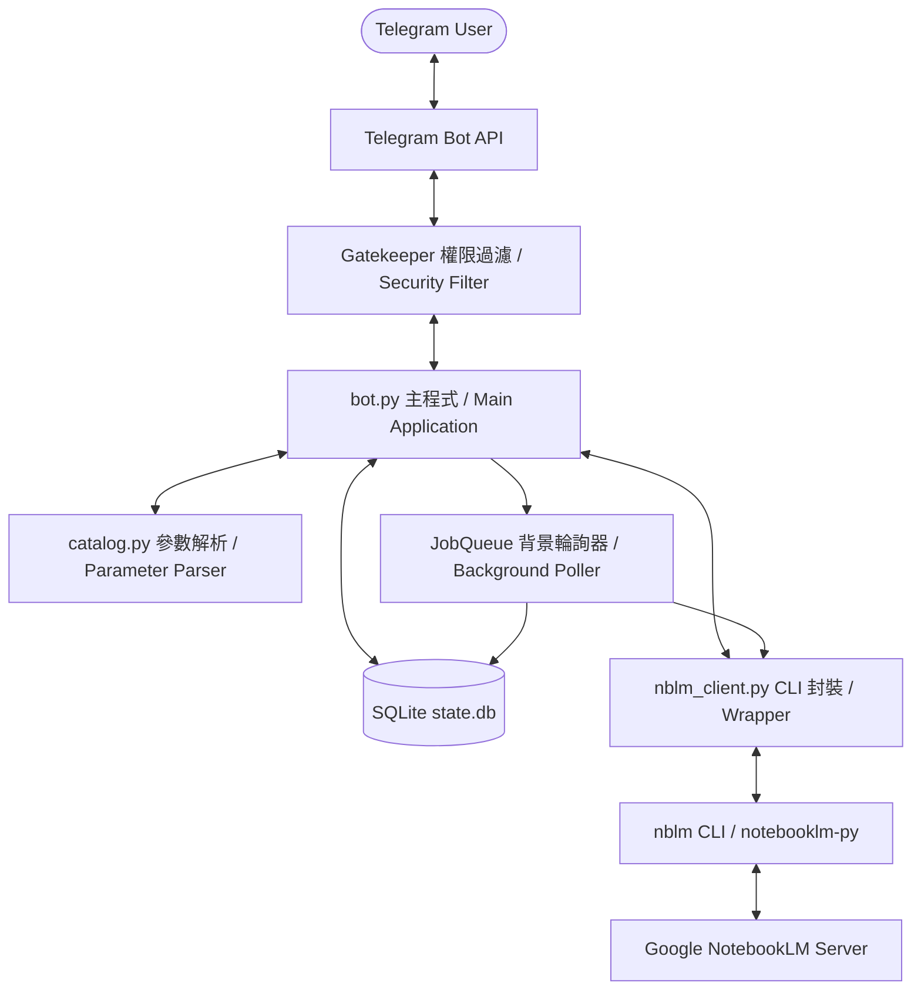
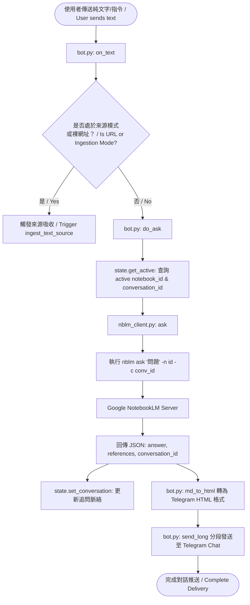
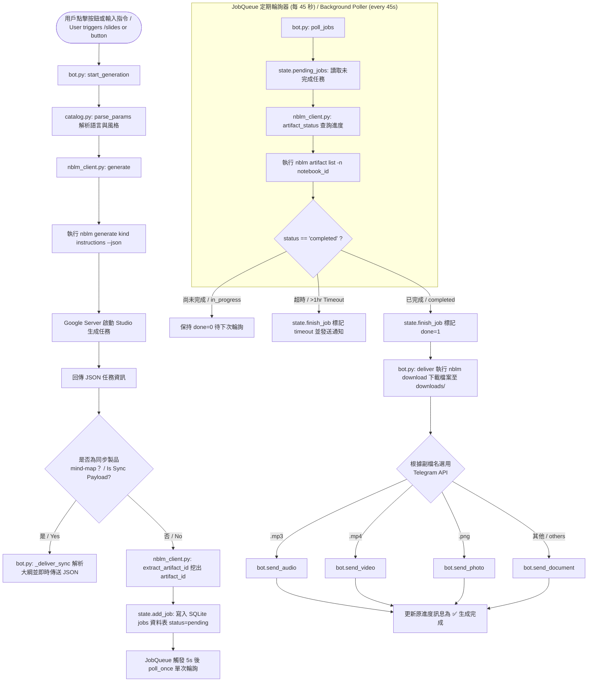
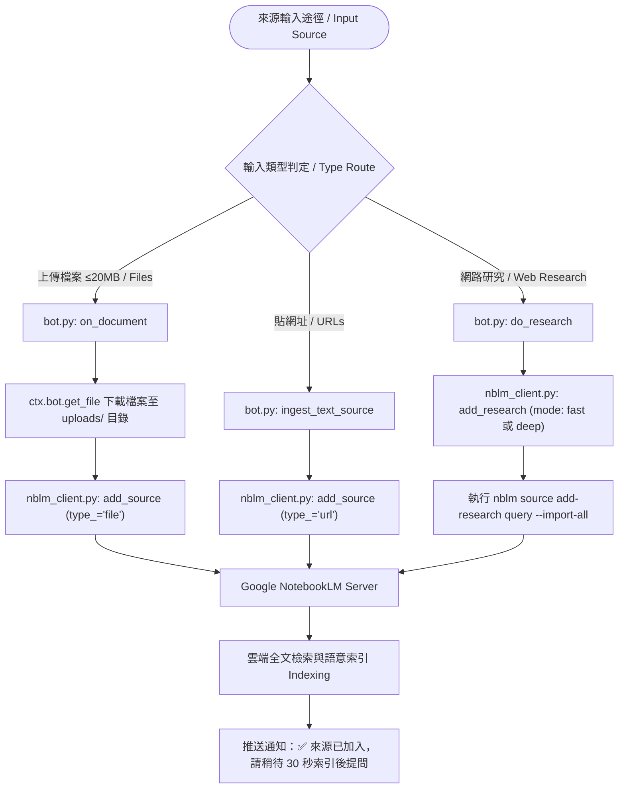

# 📓 YangNBLM_bot (lm-bot) — Google NotebookLM Telegram Bot Assistant / Telegram 智能助理

[繁體中文 Traditional Chinese] | [English]

`YangNBLM_bot` 是一個以 Python 打造的 Telegram 前端 Bot 服務，將 **Google NotebookLM (Gemini Notebook)** 的強大知識庫、AI 提問、來源管理以及 Studio 製品生成功能完整串接至 Telegram 介面。

`YangNBLM_bot` is a Python-powered Telegram bot frontend that integrates **Google NotebookLM (Gemini Notebook)**'s core capabilities—grounded AI Q&A, source ingestion, web research, and Studio artifact generation—directly into your Telegram client.

本專案支援 **多用戶對話隔離**、**免指令直接提問**、**一鍵觸發 9 種 Studio 製品生成與檔名推送**、**自動化網路研究 (Fast / Deep Research)** 以及 **權限白名單機制**。

Features include **multi-chat isolation**, **commandless Q&A**, **one-tap Studio artifact generation for 9 formats**, **automated web research (Fast/Deep)**, and **allowlist security controls**.

---

## 📚 引用外部專案與技術棧 / Dependencies & Tech Stack

### 引用外部專案 / External Repository Reference
本專案的核心 backend 引擎基於 GitHub 開源專案：
The core backend engine of this project relies on the open-source GitHub repository:
* **[teng-lin/notebooklm-py](https://github.com/teng-lin/notebooklm-py)**：Google Gemini Notebook 的非官方 Python API & CLI 工具。 / Unofficial Python API & CLI tool for Google Gemini Notebook.
* **介面整合方式 / Integration Method**：本專案透過 `/home/ubuntu/.local/bin/nblm` 腳本全域呼叫 `notebooklm-py` CLI，將 API 操作包裝為非同步 subprocess 呼叫，實現與 NotebookLM 伺服器端的溝通。 / This bot invokes the `notebooklm-py` CLI via a global wrapper script (`nblm`), converting API calls into asynchronous subprocess execution to interact with Google's NotebookLM servers.

### 技術棧 / Tech Stack
1. **Core Language & Runtime**: Python 3.10+
2. **Telegram Framework**: `python-telegram-bot` (v20+ Async Framework)
3. **Database**: SQLite3 (使用 Python 原生 `sqlite3` 與 thread locking 機制 / Built-in `sqlite3` with thread locking)
4. **Environment & Process Management**: `uv` (Fast Python package installer and resolver)
5. **Subprocess Management**: Python `asyncio.subprocess` (處理 CLI 命令執行與逾時控制 / Asynchronous CLI execution and timeout management)

---

## 🔑 NotebookLM 的登入與認證機制 / Authentication Mechanism

Google NotebookLM 官方目前**未提供公開的 OAuth API 介面**，因此底層 `notebooklm-py` 是採用模擬真實瀏覽器取得的 **Google Session Cookies** 進行身份驗證。

Google NotebookLM does **not provide an official public OAuth API**. Therefore, `notebooklm-py` authenticates using **Google Session Cookies** extracted from real browser sessions.

### 驗證原理 / Authentication Concept
驗證依賴於 Google 帳號的 Cookie 組合（包含 `SID`, `HSID`, `SSID`, `APISID`, `SAPISID`, `__Secure-1PSID`, `__Secure-1PSIDTS` 等）。其中 `__Secure-1PSIDTS` 的有效期限較短（約 600 秒刷新一次），`notebooklm-py` 內部會自動處理 Cookie 旋轉 (L1 RotateCookies POST)。

Authentication relies on Google session cookies (`SID`, `__Secure-1PSID`, `__Secure-1PSIDTS`, etc.). `notebooklm-py` manages Cookie rotation (L1 RotateCookies POST) automatically.

### 登入與認證設定方式 / Authentication Setup Methods

#### 1. 互動式 CLI 登入 / Interactive CLI Login (`notebooklm login`)
在伺服器端或本地終端機執行： / Run on the server or local terminal:
```bash
notebooklm login
```
* **運作機制 / Mechanism**：首次執行會自動下載 Playwright Chromium 瀏覽器（約 170MB），並彈出瀏覽器畫面引導使用者登入 Google 帳號。登入完成後，驗證 Cookie 會自動儲存至 `~/.notebooklm/storage_state.json`。 / Launches a headless Playwright Chromium browser (~170MB) to guide Google login and saves credentials to `~/.notebooklm/storage_state.json`.

#### 2. Cookie 匯入 / Cookie Import (`notebooklm auth import`)
無頭伺服器 (Headless Server) 或遠端環境可以透過匯入已有 Cookie 進行驗證： / Import existing cookies on headless or remote environments:
```bash
notebooklm auth import /path/to/cookies.json
```

#### 3. 自動刷新與持久化認證 / Master-Token Automatic Refresh (L4 Master-Token Re-mint)
為了確保 Bot 長期運作不中斷，`notebooklm-py` 支援 L4 Master Token 重新簽發機制（Master-token re-mint）。即便 Cookie 暫時過期，內部也能在背景自動向 Google 重新取得無頭驗證憑證，無需人工介入重新登入。

Supports L4 master-token re-minting to automatically renew expired session cookies without manual intervention for long-running headless bots.

#### 4. 驗證狀態檢查 / Status Verification
在專案中可隨時透過 CLI 檢查驗證狀態： / Check authentication status anytime via CLI:
```bash
notebooklm auth check --test --json
```

---

## ⚙️ 系統架構與工作流程 / Architecture & Workflow



### 關鍵運作流程 / Core Workflow Steps:
1. **白名單與自動綁定 / Allowlist Gatekeeper**:
   `TypeHandler` (group -1) filters updates via `gatekeeper()`. Unlisted users are blocked. If `ALLOWED_CHAT_IDS` is empty, the first interacting user is auto-bound as owner.
2. **Chat 狀態隔離 / Per-chat State Isolation**:
   Each Telegram chat maintains its own active notebook ID & conversation context in SQLite (`state.db`), preventing multi-user conflicts.
3. **免指令提問 / Commandless Q&A**:
   Sending plain text automatically queries the active notebook (`nblm.ask()`) and returns cited Markdown answers.
4. **Studio 製品生成與 Polling / Studio Artifact Generation & Async Polling**:
   Generates 9 artifact kinds via `nblm.generate()`. Sync artifacts (mind maps) deliver immediately; async artifacts (MP3 podcasts, MP4 videos, PDF slides) queue in SQLite and poll every 45s until ready for delivery.

---

### 🧩 細項功能模組流程圖 / Detailed Functional Flowcharts

#### 1. 免指令對話與追問脈絡資訊流 / Commandless Q&A Flowchart



#### 2. 一鍵 Studio 製品生成與背景 Polling 資訊流 / Studio Artifact Generation & Poller Flowchart



#### 3. 來源吸收與網路研究資訊流 / Source Ingestion & Web Research Flowchart



---

## 📁 程式碼檔案與 Function 詳細說明 / Codebase Reference

專案由 4 個核心 Python 程式碼檔案組成： / The codebase consists of 4 core Python modules:

### 1. `bot.py` — Telegram Bot 主程式與控制邏輯 / Main Bot Logic & Handlers
* **`main()`**: Bot 主入口，載入環境變數、初始化 SQLite、設定 Telegram `Application`Handlers 與背景 `JobQueue`。 / Application entry point; initializes DB, Handlers, and `JobQueue`.
* **`gatekeeper(update, ctx)`**: 第一層白名單權限過濾器 (group -1)。 / Security filter (group -1) blocking unauthorized Telegram users.
* **`authorized(update)`**: 檢查 User/Chat ID 是否在白名單內，支援首位使用者 Auto-bind。 / Checks whitelist and handles first-user auto-binding.
* **`cmd_notebooks()`, `cmd_panel()`, `cmd_sources()`, `cmd_artifacts()`, `cmd_new()`**: 控制面板與清單選單命令處理器。 / Command handlers for panels, sources, artifacts, and resetting session context.
* **`on_text(update, ctx)`**: 實現「免指令提問」與裸網址自動吸收。 / Handles commandless text Q&A and auto URL ingestion.
* **`do_ask(update, ctx, question)`**: 執行 NotebookLM 提問、維持追問 ID 並切分推送回答。 / Executes Q&A queries, retains conversation IDs, and sends long responses.
* **`on_document(update, ctx)`**: 下載用戶傳送的檔案 (≤20MB) 並加入筆記本來源。 / Downloads user-uploaded files and ingests them into the notebook.
* **`start_generation()`, `deliver()`**: 發起 Studio 製品生成，由 `poll_jobs()` 定時輪詢並推送完成檔案。 / Triggers artifact generation and handles file download & delivery.

### 2. `nblm_client.py` — NotebookLM CLI 非同步封裝庫 / CLI Wrapper Module
* **`_run(args, timeout)`**: 核心非同步 subprocess 執行器，負責執行 `nblm` 並管理逾時。 / Executes `nblm` CLI commands via `asyncio.subprocess`.
* **`_friendly_error(stderr)`**: 將 CLI 底層錯誤轉譯為使用者友善的中文提示。 / Translates CLI errors into user-friendly diagnostic messages.
* **`list_notebooks()`, `list_sources()`, `create_notebook()`, `add_source()`, `add_research()`**: 筆記本與來源 CRUD 命令 API 封裝。 / Wrapper functions for notebook and source management.
* **`ask()`, `generate()`, `list_artifacts()`, `download()`, `auth_ok()`**: 問答、製品生成、下載與認證測試介面。 / API interfaces for Q&A, artifact generation, downloading, and auth checks.

### 3. `catalog.py` — 製品種類與參數解析器 / Artifact Catalog & Parameter Parser
* **`CATALOG`**: 映射 9 種 Studio 製品（語音、簡報、資訊圖表、心智圖、報告、測驗、學習卡、資料表、影片）之細節設定。 / Maps configuration for 9 Studio artifact kinds.
* **`parse_params(kind, text)`**: 將自由文字拆解為 `nblm` 選項（自動識別多語言 `zh_Hant`、手繪/專業風格與圖片方向）。 / Parses free text into `nblm` flags (languages, styles, orientation).

### 4. `state.py` — SQLite 狀態管理庫 / SQLite State Manager
* **`init()`**: 建立 `chat_state` 與 `jobs` 資料表。 / Initializes SQLite tables (`chat_state`, `jobs`).
* **`set_active()`, `get_active()`, `set_conversation()`**: 管理特定 Chat 的作用中筆記本與對話上下文。 / Manages per-chat active notebooks and conversation IDs.
* **`add_job()`, `pending_jobs()`, `finish_job()`**: 非同步生成任務佇列 CRUD 操作。 / Manages async generation job queue for background polling.

---

## 🔒 權限白名單與 Telegram ID / Allowlist & Telegram ID Guide

### 1. 取得 Telegram User ID / How to get your Telegram User ID
* **方法 / Method**: 在 Telegram 搜尋並傳送訊息給 `@userinfobot` 或 `@raw_data_bot` 即可取得一串數字 ID（例如 `7030555903`）。 / Message `@userinfobot` on Telegram to get your numerical user ID.

### 2. 白名單增加步驟 / How to add to Allowlist
1. 編輯 [.env](file:///home/ubuntu/lm-bot/.env) 檔案： / Edit the `.env` file:
   ```env
   ALLOWED_CHAT_IDS=7030555903,123456789
   ```
2. 重新啟動 Bot 服務。 / Restart the bot service.

---

## ⚖️ 合法性、風險與注意事項 / Legality, Risks & Disclaimer

1. **合法性 / Legality**:
   `notebooklm-py` 是由社群開發的非官方逆向封裝庫。個人學習、研究與知識庫自動化**並不違法**。 / `notebooklm-py` is an unofficial open-source library. Personal research and self-use do not violate laws.
2. **技術風險 / Technical Risks**:
   * **API 變更 / Breaking Changes**: Google 隨時可能修改 RPC 端點，需定期更新 `notebooklm-py`。 / Google internal APIs may change anytime; update library via `uv tool upgrade notebooklm-py`.
   * **限流 / Rate Limiting**: 短時間高頻提問可能觸發 Rate Limit，冷卻 5~15 分鐘即可恢復。 / Heavy usage may cause temporary rate limits.
3. **合規建議 / Compliance**:
   請勿用於商業轉售 (Reselling) 或高頻惡意爬取；僅建議於個人或小團隊內部私人存取。 / Do not use for commercial reselling or abusive scraping.
