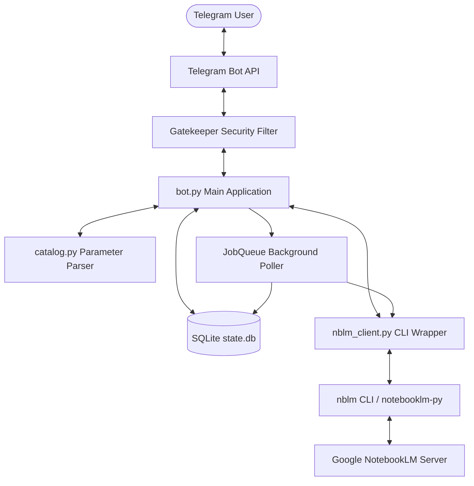
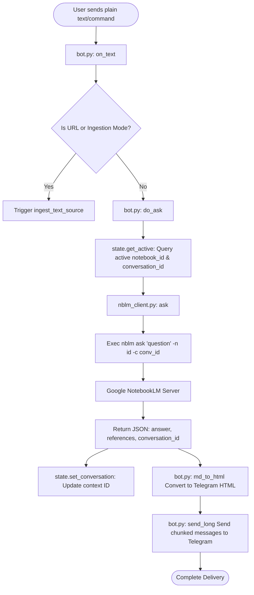
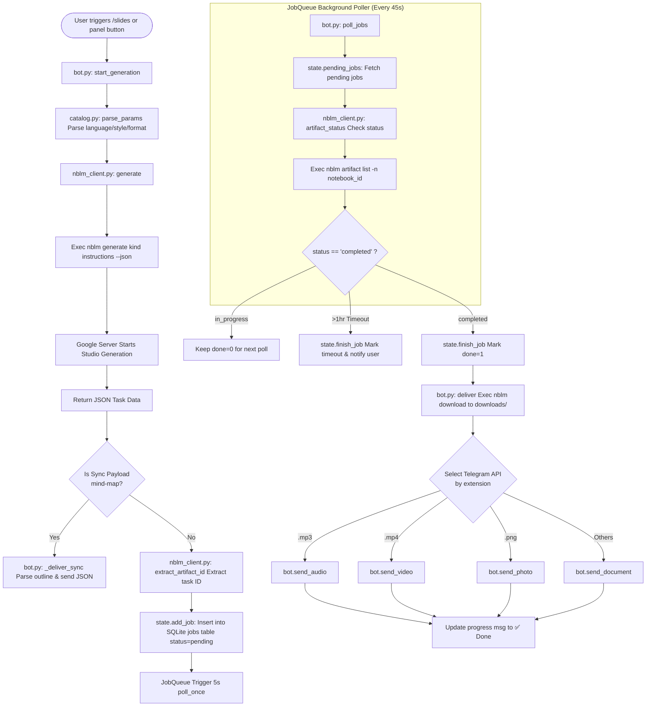
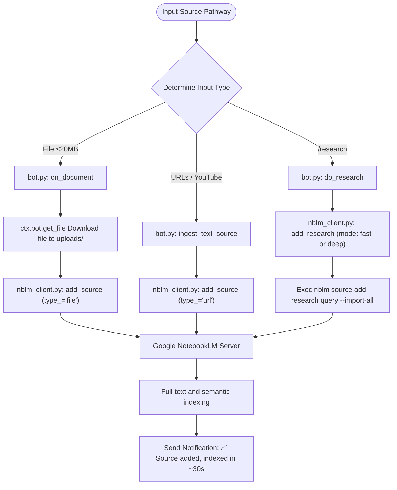

# 📓 YangNBLM_bot (lm-bot) — Google NotebookLM Telegram Bot Assistant

🌐 **Language / 語言**: **[ [繁體中文](README.md) | English ]**

`YangNBLM_bot` is a Python-powered Telegram bot frontend that brings the full power of **Google NotebookLM (Gemini Notebook)**—grounded AI Q&A, source ingestion, web research, and Studio artifact generation—directly into your Telegram client.

Features include **per-chat multi-user isolation**, **commandless Q&A**, **one-tap Studio artifact generation for 9 formats with automated file delivery**, **automated web research (Fast / Deep Research)**, and **allowlist security controls**.

---

## 📚 Dependencies & Tech Stack

### External Repository Reference
The core backend engine of this project relies on the open-source GitHub repository:
* **[teng-lin/notebooklm-py](https://github.com/teng-lin/notebooklm-py)**: An unofficial Python API & CLI tool for Google Gemini Notebook.
* **Integration Method**: This bot invokes the `notebooklm-py` CLI via a global wrapper script (`/home/ubuntu/.local/bin/nblm`), converting API calls into asynchronous subprocess execution to communicate with Google's NotebookLM servers.

### Tech Stack
1. **Core Language & Runtime**: Python 3.10+
2. **Telegram Framework**: `python-telegram-bot` (v20+ Async Framework)
3. **Database**: SQLite3 (Built-in Python `sqlite3` with thread locking)
4. **Environment & Package Management**: `uv` (Fast Python package installer and resolver)
5. **Subprocess Management**: Python `asyncio.subprocess` (Asynchronous CLI execution and timeout management)

---

## 🔑 NotebookLM Authentication Mechanism

Google NotebookLM currently **does not offer an official public OAuth API**. Therefore, `notebooklm-py` authenticates using **Google Session Cookies** extracted from real browser sessions.

### Authentication Concept
Authentication relies on Google session cookies (`SID`, `HSID`, `SSID`, `APISID`, `SAPISID`, `__Secure-1PSID`, `__Secure-1PSIDTS`, etc.). Short-lived cookies like `__Secure-1PSIDTS` (~600s TTL) are automatically rotated internally via L1 RotateCookies POST requests.

### Authentication Setup Methods

#### 1. Interactive CLI Login (`notebooklm login`)
Run on the server or local terminal:
```bash
notebooklm login
```
* **Mechanism**: On the first run, it downloads a headless Playwright Chromium browser (~170MB), launches a browser window for Google sign-in, and saves session cookies to `~/.notebooklm/storage_state.json`.

#### 2. Cookie Import (`notebooklm auth import`)
Import existing browser session cookies on headless servers or remote environments:
```bash
notebooklm auth import /path/to/cookies.json
```

#### 3. Master-Token Automatic Refresh (L4 Master-Token Re-mint)
Supports L4 master-token re-minting to automatically renew expired session cookies without browser interaction for long-running headless bots.

#### 4. Authentication Status Check
Verify session validity via CLI anytime:
```bash
notebooklm auth check --test --json
```

---

## ⚙️ Architecture & Workflow



### Core Workflow Steps:
1. **Allowlist Gatekeeper**:
   `TypeHandler` (group -1) filters updates via `gatekeeper()`. Unlisted users are blocked. If `ALLOWED_CHAT_IDS` is empty, the first interacting user is auto-bound as owner.
2. **Per-chat State Isolation**:
   Each Telegram chat maintains its own active notebook ID & conversation context in SQLite (`state.db`), preventing multi-user conflicts.
3. **Commandless Q&A**:
   Sending plain text automatically queries the active notebook (`nblm.ask()`) and returns cited Markdown answers.
4. **Studio Artifact Generation & Async Polling**:
   Generates 9 artifact kinds via `nblm.generate()`. Sync artifacts (mind maps) deliver immediately; async artifacts (MP3 podcasts, MP4 videos, PDF slides) queue in SQLite and poll every 45s until ready for delivery.

---

### 🧩 Detailed Functional Flowcharts

#### 1. Commandless Q&A & Context Flowchart



#### 2. Studio Artifact Generation & Async Poller Flowchart



#### 3. Source Ingestion & Web Research Flowchart



---

## 📁 Codebase Reference

The codebase consists of 4 core Python modules:

### 1. `bot.py` — Main Application & Telegram Logic
* `load_env()`, `_parse_allowlist()`, `_persist_allowlist()`, `main()`, `post_init()`: App initialization and config loading.
* `authorized()`, `gatekeeper()`: Security gatekeeper and allowlist filter.
* `esc()`, `md_to_html()`, `send_long()`, `panel_markup()`, `more_markup()`, `addsrc_markup()`: Text formatting and inline keypads.
* `cmd_start()`, `cmd_help()`, `cmd_notebooks()`, `cmd_panel()`, `cmd_sources()`, `cmd_artifacts()`, `cmd_new()`, `cmd_ask()`, `do_ask()`, `cmd_addsource()`, `cmd_newnotebook()`, `cmd_research()`, `cmd_deepresearch()`: Command handlers.
* `on_text()`, `ingest_text_source()`, `do_research()`, `on_document()`, `on_callback()`: Event listeners.
* `start_generation()`, `_deliver_sync()`, `_mindmap_outline()`, `deliver()`, `_kind_from_type()`: Studio artifact generation and media delivery.
* `poll_once()`, `poll_jobs()`, `_check_job_by_id()`: Background JobQueue polling.

### 2. `nblm_client.py` — CLI Async Wrapper
* `NblmError`, `Artifact`, `_run()`, `_friendly_error()`, `_parse_json()`: Subprocess runner and error translation.
* `list_notebooks()`, `list_sources()`, `create_notebook()`, `add_source()`, `add_research()`, `delete_source()`, `source_status()`: Notebook and source management.
* `ask()`, `generate()`, `extract_artifact_id()`, `is_sync_payload()`, `list_artifacts()`, `artifact_status()`, `download()`, `auth_ok()`: Q&A, artifact generation, downloads, and auth test APIs.

### 3. `catalog.py` — Artifact Catalog & Parameter Parser
* `CATALOG`, `PRIMARY`, `SECONDARY`, `EMOJI`: Mapping definitions for 9 Studio artifact kinds.
* `LANGUAGES`, `INFOGRAPHIC_STYLES`, `VIDEO_STYLES`, `ORIENTATIONS`, `AUDIO_FORMATS`, `REPORT_FORMATS`, `DIFFICULTY`: Multi-language and styling dictionaries.
* `parse_params()`: Parses free text input into `nblm` flags.

### 4. `state.py` — SQLite Local State Manager
* `_conn()`, `init()`: Database initialization.
* `set_active()`, `get_active()`, `clear_active()`, `set_conversation()`: Chat state and conversation ID manager.
* `add_job()`, `pending_jobs()`, `finish_job()`: Async generation job queue manager.

## 🚀 How to Run & Telegram Integration

### 1. How to Start the Project?

#### Step 1: Configure Environment Variables (.env)
Create or confirm your `.env` file in the root directory (refer to `.env.example`):
```env
TELEGRAM_BOT_TOKEN=YOUR_TELEGRAM_BOT_TOKEN
ALLOWED_CHAT_IDS=YOUR_TELEGRAM_ID
```

#### Step 2: Verify NotebookLM CLI Auth Status
Ensure `nblm` authentication is active on your server:
```bash
/home/ubuntu/.local/bin/nblm auth check
```
*(If authentication has expired, run `notebooklm login` on the server to re-authenticate)*

#### Step 3: Run the Bot Service
Execute the main application [`bot.py`](file:///home/ubuntu/lm-bot/bot.py):
* **Direct Execution**:
  ```bash
  python3 bot.py
  # Or using virtualenv
  /home/ubuntu/lm-bot/.venv/bin/python3 bot.py
  ```
* **Run in Background**:
  ```bash
  nohup python3 bot.py > bot.log 2>&1 &
  ```

---

### 2. Main Telegram Integration Module

All core integration logic and Telegram API event listeners are centralized in **[`bot.py`](file:///home/ubuntu/lm-bot/bot.py)**.

#### Core Integration Highlights:
1. **Telegram Listener Loop (bot.py L992 ~ L1037)**:
   In `main()`, `python-telegram-bot`'s `Application.builder()` loads the Token and starts long-polling via `app.run_polling()`.
2. **Handlers Registration (bot.py L1008 ~ L1032)**:
   * `TypeHandler(Update, gatekeeper)`: Allowlist security filter (group -1).
   * `CommandHandler`: Handles commands like `/start`, `/notebooks`, `/panel`, `/ask`, `/research`.
   * `CallbackQueryHandler(on_callback)`: Handles Inline Keyboard panel button clicks.
   * `MessageHandler(filters.Document..., on_document)`: Receives uploaded files (≤20MB).
   * `MessageHandler(filters.TEXT..., on_text)`: Enables commandless text Q&A and auto URL ingestion.
3. **Telegram API Calls**:
   * Text & Markdown sending: `reply_text()`, `send_long()`
   * Typing action: `ctx.bot.send_chat_action(chat_id, ChatAction.TYPING)`
   * Media pushing: `send_audio()`, `send_video()`, `send_photo()`, `send_document()`
   * File downloading: `ctx.bot.get_file()` and `download_to_drive()`

---

## 🔒 Security Allowlist & Telegram ID Guide

### 1. How to get your Telegram User ID
* Message `@userinfobot` or `@raw_data_bot` on Telegram to receive your numerical User ID (e.g., `7030555903`).
* First-user Auto-bind: If `ALLOWED_CHAT_IDS=` is left empty in `.env`, the first user sending a message will be auto-bound as owner.

### 2. Adding users to Allowlist
Edit `ALLOWED_CHAT_IDS=` in `.env` (separate multiple IDs with commas):
```env
ALLOWED_CHAT_IDS=7030555903,123456789
```

---

## ⚖️ Legality, Risks & Disclaimer

1. **Legality**: `notebooklm-py` is an open-source community wrapper. Using it for personal research or internal automation is legal.
2. **Risks**:
   * **Breaking Changes**: Google internal RPC APIs may change; update the library via `uv tool upgrade notebooklm-py`.
   * **Rate Limits**: Heavy automated queries may cause temporary rate limits (~5-15 min cooldown).
3. **Compliance Advice**: Do not use for commercial reselling or abusive automated scraping. Intended for personal or small team internal use.

